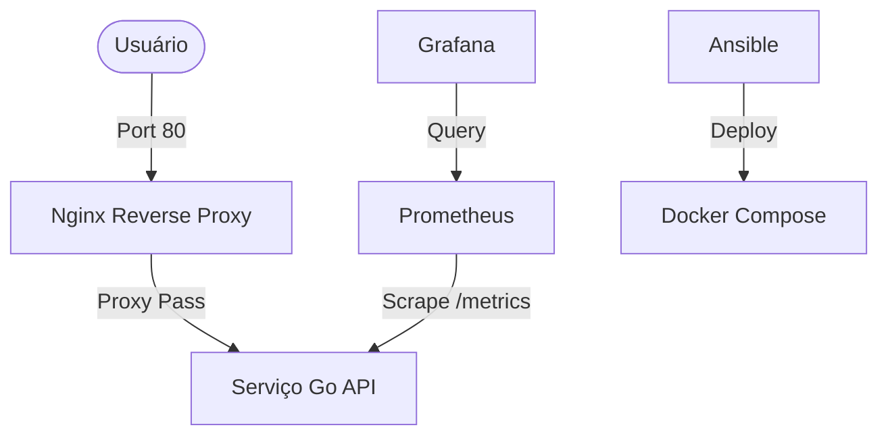

# http-server-projeto-korp

🧭 **1. Visão geral do projeto**

Este projeto é uma API HTTP desenvolvida em **Go** que fornece informações básicas em formato JSON. Ele foi concebido como um desafio técnico completo, integrando não apenas o desenvolvimento da aplicação, mas todo o ecossistema de infraestrutura e observabilidade.

**Objetivo do desafio:** Demonstrar proficiência em Golang, containerização com Docker, proxy reverso com Nginx, monitoramento com Prometheus/Grafana e automação de infraestrutura com Ansible.

---

🧱 **2. Arquitetura**

A solução é composta por múltiplos containers que se comunicam em uma rede isolada:



*   **Serviço Go (API HTTP):** O núcleo da aplicação, processando requisições e gerando métricas.
*   **Nginx:** Atua como proxy reverso, sendo a única porta de entrada para o tráfego web (Porta 80).
*   **Prometheus:** Responsável por coletar e armazenar métricas temporais da aplicação.
*   **Grafana:** Interface visual para análise das métricas via dashboards pré-configurados.
*   **Docker Compose:** Orquestra a criação e interconexão de todos os serviços.
*   **Ansible:** Automatiza o provisionamento do ambiente (Instalação do Docker e deploy).

---

🔌 **3. Endpoints da aplicação**

### `GET /projeto-korp`
Retorna o nome do projeto e o horário atual em UTC.
*   **Exemplo de resposta:**
    ```json
    {
      "nome": "Projeto Korp",
      "horario": "2026-06-16 14:30:00.123456789 +0000 UTC"
    }
    ```

### `GET /metrics`
Expõe métricas no formato compatível com o Prometheus.
*   Inclui a métrica customizada `http_requests_total`.

---

🐳 **4. Como rodar com Docker Compose**

Para subir todo o ambiente rapidamente:

```bash
# Subir os containers em background
docker compose up -d --build

# Parar e remover os containers
docker compose down
```

**Portas Expostas:**
*   **App (Nginx):** [http://localhost](http://localhost) (Porta 80)
*   **Grafana:** [http://localhost:3000](http://localhost:3000) (Admin/Admin)
*   **Prometheus:** [http://localhost:9090](http://localhost:9090)

---

⚙️ **5. Infraestrutura (Docker)**

O projeto utiliza uma rede do tipo bridge chamada `korp-network` para garantir que os containers possam se comunicar pelo nome de serviço (ex: `http://prometheus:9090`).

*   `http-server-projeto-korp`: Container da aplicação Go (Porta interna 8080).
*   `nginx`: Proxy reverso expondo a porta 80.
*   `prometheus`: Coletor de métricas.
*   `grafana`: Visualizador de métricas.

---

📊 **6. Observabilidade**

A aplicação Go utiliza o SDK oficial do Prometheus para expor métricas internas. O Prometheus está configurado para fazer *scrape* a cada 5 segundos.

**Principais métricas monitoradas:**
*   `http_requests_total`: Contador total de requisições recebidas pelo endpoint `/projeto-korp`.
*   `up`: Indica se a instância da aplicação está ativa (disponibilidade).
*   `rate(http_requests_total[1m])`: Taxa de requisições por segundo.

---

🧠 **7. Grafana (Bônus)**

O Grafana já vem **provisionado automaticamente**:
*   **Datasource:** O Prometheus é configurado como fonte de dados padrão via YAML.
*   **Dashboards:** O painel "Monitoramento Projeto Korp" é carregado automaticamente na inicialização do container através do mapeamento de volumes em `/etc/grafana/provisioning`.

---

🤖 **8. Automação com Ansible**

O ambiente pode ser totalmente provisionado com **um único comando**. O playbook localizado em `ansible/playbook.yml` realiza:
1.  Configuração da infraestrutura (Docker, Compose, Rede).
2.  Deploy dos containers.
3.  **Validação Automática:** Realiza uma requisição HTTP ao endpoint `/projeto-korp` e **exibe o payload JSON diretamente no seu terminal**.

**Comando para provisionamento:**
```bash
# O flag -K solicita a senha de sudo para instalar dependências
ansible-playbook -i ansible/inventory.ini ansible/playbook.yml -K
```

---

🧪 **9. Como testar**

Siga este checklist após subir o ambiente (ou observe a saída do Ansible):

- [ ] **API:** `curl http://localhost/projeto-korp` (Deve retornar JSON)
- [ ] **Métricas:** `curl http://localhost/metrics` (Deve retornar texto plano Prometheus)
- [ ] **Prometheus:** Acesse `http://localhost:9090` e procure pela métrica `http_requests_total`.
- [ ] **Grafana:** Acesse `http://localhost:3000` (login: `admin`/`admin`) e abra o dashboard "Monitoramento Projeto Korp".

---

📦 **10. Estrutura do projeto**

```text
├── ansible/          # Automação do ambiente (Playbook e Inventário)
├── grafana/          # Provisionamento de Dashboards e Datasources
├── handlers/         # Lógica dos Handlers HTTP (Go)
├── metrics/          # Definição de métricas customizadas (Go)
├── models/           # Estruturas de dados (Go)
├── nginx/            # Configuração do Proxy Reverso
├── prometheus/       # Configuração de Scrape do Prometheus
├── services/         # Regras de negócio/serviços (Go)
├── main.go           # Ponto de entrada da aplicação
└── docker-compose.yml # Orquestração dos serviços
```

---

🚨 **11. Requisitos**

*   **Docker & Docker Compose (V2):** Necessários no host onde os containers rodarão.
*   **Ansible:** Necessário na máquina de controle. O playbook está configurado para rodar em **localhost** (definido em `ansible/inventory.ini`), facilitando a avaliação em ambiente local ou em uma VM Linux.
*   **Go 1.23+:** Opcional (apenas para desenvolvimento local fora do Docker).

---